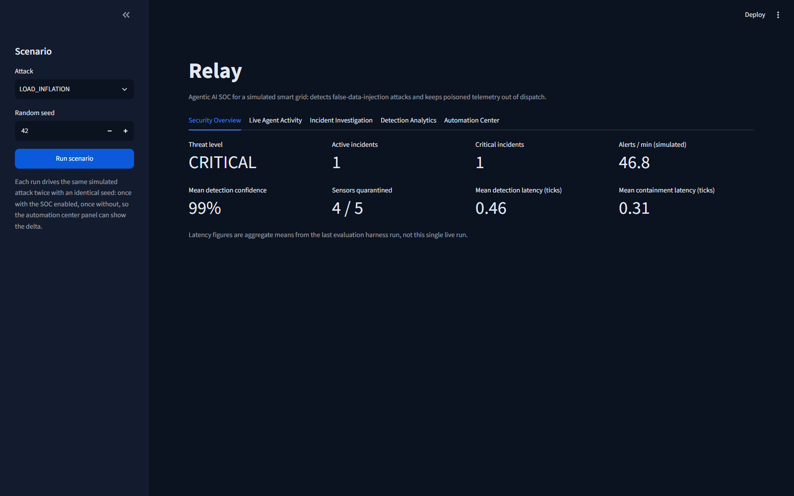
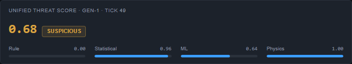
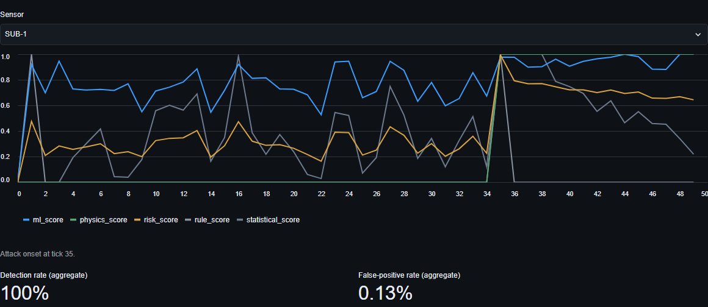
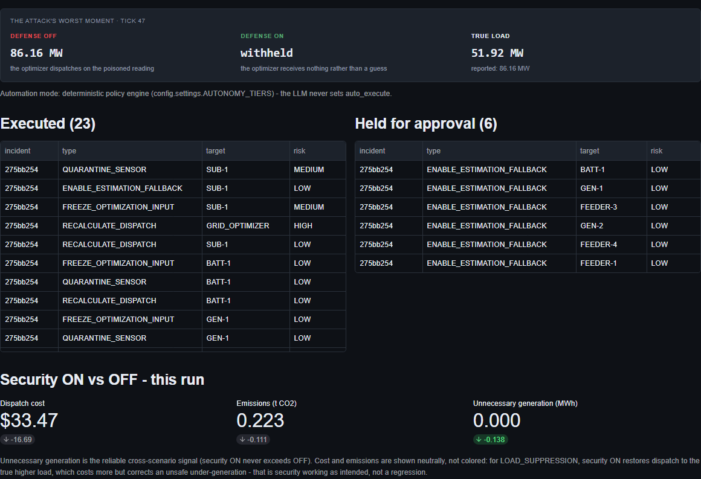
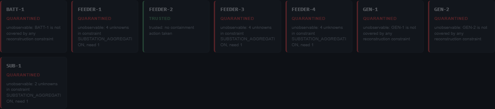
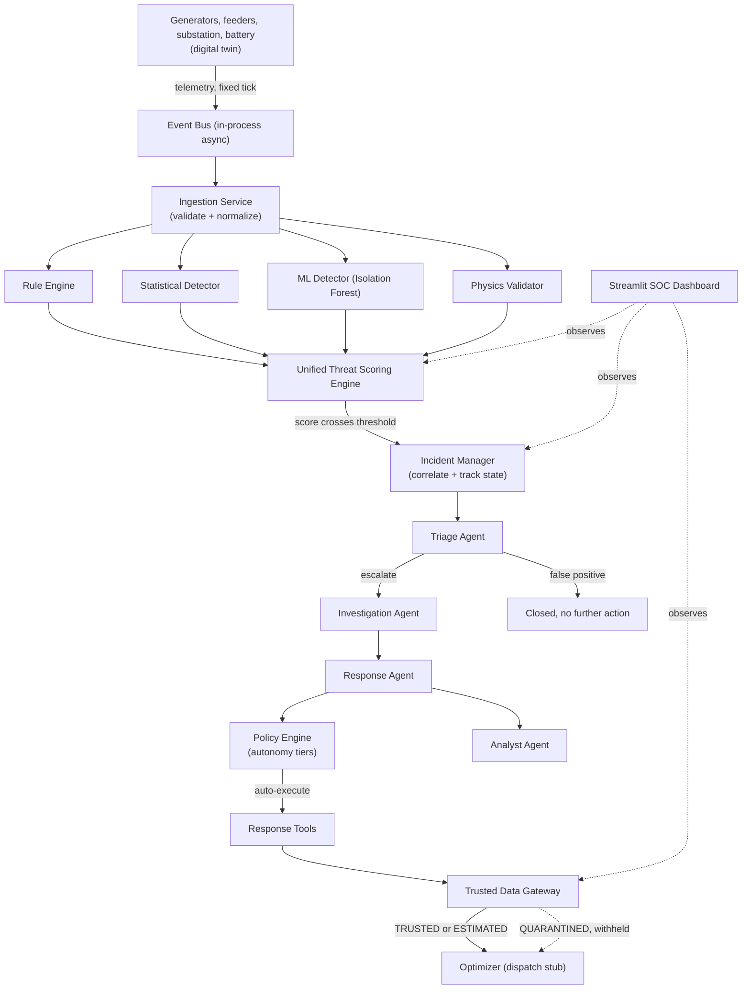
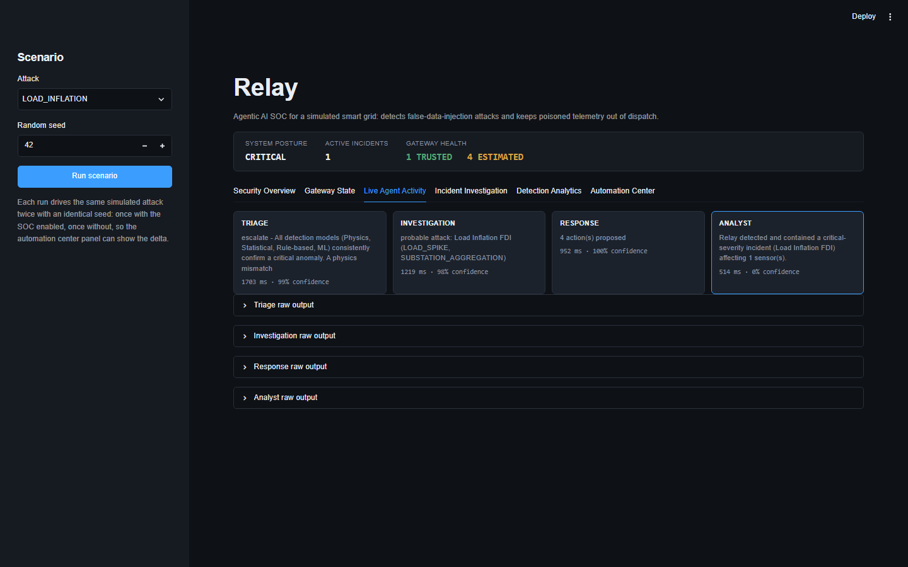

<h1 align="center">Relay</h1>
 
<p align="center">
  An AI-driven Security Operations Center that keeps false-data-injection attacks out of a smart grid's dispatch decisions.<br/>
  Verify the telemetry first. Optimize second.
</p>
<p align="center">
  <a href="https://relay-soc.streamlit.app/"><b>Live demo</b></a> ·
  <a href="#getting-started"><b>Get started</b></a> ·
  <a href="#trusted-data-gateway"><b>Trusted Data Gateway</b></a> ·
  <a href="#architecture"><b>Architecture</b></a> ·
  <a href="#key-results"><b>Key results</b></a> ·
  <a href="#limitations"><b>Limitations</b></a> ·
  <a href="#roadmap"><b>Roadmap</b></a>
</p>
<p align="center">
  <a href="https://relay-soc.streamlit.app/"></a>
  
  
  
  
</p>
---
 
## Overview
 
<p align="center">
  <a href="https://relay-soc.streamlit.app/">
    
  </a>
</p>
A smart grid optimizes generation and distribution from live sensor data. That data is also the attack surface: a false-data-injection (FDI) attack manipulates readings so the grid acts on a false picture of reality. Inflate a load reading and the optimizer over-generates, raising cost and emissions for no reason. Suppress it and the optimizer under-generates against real demand, cutting reserve margin and risking unsafe dispatch. An optimizer that trusts its inputs unconditionally is only as safe as the sensors feeding it, and those sensors can be attacked.
 
## Design
 
Red means quarantined. Nothing else in this interface is ever red: not a button, not a chart series, not a negative delta, not a hover state. A suspicious reading, a critical incident, a low-confidence agent decision, all of it renders in blue or amber. Red marks exactly one state: a sensor whose raw reading is being withheld from dispatch. A reviewer reads containment posture at a glance, without parsing a single label, because color only ever means one thing here.
 
The rest of the token system is a locked seven-color palette: a dark graphite background, two elevated surface tones for panels and table headers, a neutral border color, two text tones for primary and muted content, and a single blue accent reserved for interactive elements, never for status. Three status colors sit on top of that base: muted green for TRUSTED, amber for ESTIMATED, and the one red for QUARANTINED. Nothing else borrows from that set.
 
Typography is IBM Plex Sans for prose and headings, IBM Plex Mono for every number, sensor ID, and timestamp, so telemetry never shifts horizontally as it updates on a live-refreshing panel. The choice is deliberate: this project is an IBM internship build, and the typeface carries that without a splash screen.
 
Five surfaces are hand-built with the app's own CSS classes instead of stock Streamlit widgets: the top status bar, the threat score card, the detection feed, the agent pipeline, and the gateway state view. Density and color stay under the app's control end to end. The sidebar, the tabs, the buttons stay plain Streamlit. Nobody looks at that scaffolding.
 
Relay treats optimization and security as one problem. It runs a simulated grid, injects three scored FDI attack patterns against it (plus one demonstration-only scenario, see [Limitations](#limitations)), and defends it with a four-detector ensemble and a bounded, policy-gated multi-agent SOC:
 
1. A digital twin of a substation and its feeders emits telemetry on a fixed tick.
2. Four independent detectors, rules, statistics, an Isolation Forest, and physics consistency checks, each score every reading; a unified risk engine combines the four into one classification.
3. Alerts that cross the risk threshold open an incident, correlating related alerts from the same time window into one case with a timeline.
4. Four AI agents, mapped to real SOC roles (Triage, Investigation, Response, Analyst), investigate the incident and propose containment actions from a fixed, auditable action set. No agent has direct control over the grid.
5. A deterministic policy engine, not the agents, decides which actions execute automatically versus which need operator approval.
6. A trusted data gateway labels every sensor TRUSTED, ESTIMATED, or QUARANTINED, and the optimizer is only ever allowed to read a TRUSTED or ESTIMATED value. A quarantined sensor's raw reading never reaches dispatch.
The optimizer is deliberately simple: a dispatch stub that reports cost and emissions for a given load. Its only job is to make the impact of poisoned versus verified data measurable, not to model real dispatch optimization.
 
## Features
 
- **Four-detector ensemble.** A rule engine (hard physical bounds), a statistical detector (rolling z-score, EWMA, rate-of-change), an Isolation Forest trained on normal telemetry, and a physics validator (power balance, feeder-to-substation aggregation, battery state-of-charge consistency). Coordinated stealth attacks that look plausible sensor-by-sensor still fail the physics cross-checks.
- **Unified Threat Scoring Engine.** Combines the four detector scores into one weighted risk score, classified into five bands (`NORMAL` through `CRITICAL`), with the full evidence breakdown attached to every reading.
- **Bounded multi-agent SOC.** Triage, Investigation, Response, and Analyst agents run in a fixed order via LiteLLM, each constrained to a JSON schema validated with Pydantic and backed by a deterministic fallback if the LLM call fails or returns invalid output. A false positive stops after Triage; only an escalation runs the full pipeline.
- **Deterministic policy engine.** `auto_execute` on every response action is set by `config.settings.AUTONOMY_TIERS`, keyed to the incident's classification, never by the LLM. One action type (`ISOLATE_SUBSTATION`) is always held for operator approval regardless of tier.
- **Trusted Data Gateway.** Every sensor stream carries a TRUSTED, ESTIMATED, or QUARANTINED label, reconstructed from physical constraints rather than history or thresholds - see [Trusted Data Gateway](#trusted-data-gateway) below.
- **Alert correlation.** Alerts within a configurable time window on related assets fold into a single incident with one timeline, instead of opening a new case per alert.
- **Evaluation harness.** Runs each attack scenario N times with randomized parameters under a fixed seed, security ON and OFF, and reports detection rate, false-positive rate, latency, and prevented cost/emissions/unnecessary-generation to `results/`.
- **Live SOC dashboard.** Six Streamlit tabs (Security Overview, Gateway State, Live Agent Activity, Incident Investigation, Detection Analytics, Counterfactual) drive the same scenario twice, security enabled and disabled, and show the delta.
<p align="center">
  
</p>
<p align="center">
  
</p>
<p align="center">
  
</p>
## Trusted Data Gateway
 
This is the centerpiece of the security model, not a filter bolted on after detection. An alert tells a human something is wrong; it does not by itself stop a poisoned reading from reaching the optimizer. The gateway is the enforcement point: `gateway/trusted_data_gateway.py` labels every sensor TRUSTED, ESTIMATED, or QUARANTINED, and the optimizer's read path checks that label before it ever sees a value. A quarantined sensor serves nothing - not a stale reading, not a guess - until it is reconstructed.
 
Reconstruction is not a fallback estimator trained on history. It solves the same physical constraint the physics detector already checks (`simulator/grid.py`'s `substation_load == sum(feeder_loads)`), and it is governed by one observability rule:
 
> **A quarantined sensor is reconstructable if and only if it is the single unknown in a constraint where every other member is currently TRUSTED.** One equation solves for exactly one unknown. Two or more unknowns in the same constraint is underdetermined - the definition of unobservable - and the sensor stays QUARANTINED with nothing served.
 
**THE ONE RULE:** an ESTIMATED member of a constraint never qualifies another member for reconstruction. Only a TRUSTED value counts as a known. You never chain an estimate off an estimate - an estimate is a prior masquerading as a measurement, and this system refuses to launder it into a second one.
 
This produces the following terminal states with zero tuning - no thresholds, no magic numbers, no sweep to make a demo work:
 
| Situation | Constraint math | Terminal state |
|---|---|---|
| Substation compromised, 4 feeders trusted | `sub = Σ feeders`, one unknown | **ESTIMATED** |
| One feeder compromised, substation and other 3 feeders trusted | `f_i = sub − Σ(other feeders)`, one unknown | **ESTIMATED** |
| Two or more feeders compromised | 2+ unknowns, 1 equation | **QUARANTINED** |
| All 4 feeders compromised (`COORDINATED_FDI`) | 4 unknowns, 1 equation | **QUARANTINED** |
| Generator or battery compromised | in no constraint, never reconstructable | **QUARANTINED** |
 
Quarantine also cascades: taking a sensor out of TRUSTED re-evaluates any ESTIMATED constraint-mate, so an estimate already being served can degrade back to QUARANTINED the moment its supporting peer becomes the second unknown - without a fresh detection event firing. `status_of(sensor_id)` returns the state plus a precise reason string (e.g. `"unobservable: 4 unknowns in constraint SUBSTATION_AGGREGATION, need 1"`), surfaced on the dashboard's Gateway State panel.
 
`ESCALATING_FDI` (see [Limitations](#limitations)) is the one scenario that puts all three states on screen together - though not quite the clean staged sequence a tidy narrative would predict, and that's worth reporting honestly rather than smoothing over. It compromises `GEN-1` and `FEEDER-1` together at onset, deliberately simultaneous rather than staged (attacking the generator alone first would let its power-balance violation quarantine the feeders before the feeder is even compromised - see `simulator/attacks/escalating_fdi.py`). At the demo seed's onset tick, verified from a real run: `GEN-1` is QUARANTINED (no constraint covers it), `BATT-1` is also QUARANTINED - not itself attacked, but `detection/physics_validator.py`'s power-balance check runs only against the battery's own reading (the last one reported each tick, so it's the one moment every peer is guaranteed fresh for that tick) and reacts to `GEN-1`'s already-poisoned generation figure baked into that same check - and `SUB-1` is ESTIMATED, reconstructed from all four feeders. `FEEDER-1` is still labeled TRUSTED at this exact tick: its own drift-based detectors haven't caught up yet, while the substation's aggregation mismatch is instant. That means the one-tick estimate briefly draws on `FEEDER-1`'s already-poisoned reading - at the captured seed, a genuine ~57 MW dispatched against a true ~52 MW, an honest gap the system hasn't caught yet rather than a hidden one. Within the next few ticks, correlated evidence and cascading re-evaluation quarantine the rest of the redundancy group well before the attack's own scripted broadening step even fires, and `SUB-1` degrades back to QUARANTINED alongside them.
 
<p align="center">
  
</p>
## Architecture
 

 
<p align="center">
  
</p>
### Project structure
 
```
relay/
├── streamlit_app.py             # dashboard entrypoint (resolves imports from repo root)
├── config/settings.py           # tunables: weights, thresholds, tolerances, tick rate
├── schemas/models.py            # every Pydantic data contract
├── simulator/                   # digital twin, telemetry, attack scenarios (3 scored, 1 demo)
├── automation/event_bus.py      # asyncio publish/subscribe
├── ingestion/service.py         # validate, normalize, publish
├── detection/                   # rule engine, statistics, Isolation Forest, physics, unified risk engine
├── soc/
│   ├── incident_manager.py      # incidents, correlation, state machine
│   ├── policy_engine.py         # classification -> autonomy tier -> auto_execute
│   ├── orchestrator.py          # drives the four agents in order
│   ├── threat_kb.py             # known attack patterns
│   ├── agents/                  # triage, investigation, response, analyst
│   └── tools/response_tools.py  # fixed safe action set
├── gateway/trusted_data_gateway.py  # TRUSTED / ESTIMATED / QUARANTINED, constraint reconstruction
├── optimization/                # dispatch stub
├── evaluation/                  # harness, ON vs OFF comparison, results output
├── dashboard/                   # Streamlit SOC dashboard
├── tests/
└── results/                     # metrics.csv, metrics.json, metrics.md (generated)
```
 
## Tech stack
 
| Layer | Technology |
|-------|------------|
| Language | Python 3.12 |
| Data contracts | Pydantic v2, for every boundary in the system |
| Simulation | NumPy, pandas |
| ML detection | scikit-learn (Isolation Forest) |
| Agent reasoning | LiteLLM (Gemini Flash on the hosted demo, Groq `gpt-oss-120b` as a documented alternative) |
| Orchestration | Hand-written deterministic state machine, no agent framework |
| Event transport | asyncio publish/subscribe (in-process) |
| Storage | SQLite |
| Dashboard | Streamlit |
| Testing / linting | pytest, ruff |
 
Two deliberate substitutions, chosen to spend the available time on the security pipeline rather than infrastructure:
 
- The in-process event bus stands in for a real message broker (MQTT or similar). It keeps one publish/subscribe seam so a broker can replace it without touching the rest of the system.
- Streamlit stands in for a production web frontend. It renders the full dashboard spec in Python with no separate frontend build.
## Getting started
 
A hosted instance runs at **[relay-soc.streamlit.app](https://relay-soc.streamlit.app/)**. It sleeps after inactivity, so the first load may take a few seconds to wake and train the Isolation Forest on startup.
 
To run it locally, requires Python 3.12+.
 
```bash
git clone <this-repo>
cd relay
python -m venv .venv
.venv/Scripts/activate        # .venv/bin/activate on macOS/Linux
pip install -r requirements.txt
cp .env.example .env          # optional, see below
```
 
Relay runs fully without an LLM key: every agent falls back to a deterministic default (logged as a warning) if no key is set or the call fails. Set `GROQ_API_KEY` or `GEMINI_API_KEY` in `.env` and adjust `LLM_MODEL` to use a real model for agent reasoning.
 
**Run the console demo** (simulator through detection, incident response, and dispatch, with one manually injected out-of-range reading):
 
```bash
python main.py
```
 
**Run the SOC dashboard:**
 
```bash
streamlit run streamlit_app.py
```
 
Pick a scenario in the sidebar and click Run scenario. The dashboard simulates the same attack twice, once with the SOC enabled and once without, and shows the live incident, agent activity, detection scores, and the cost and emissions delta between the two runs.
 
**Run the evaluation harness** (produces `results/metrics.csv`, `results/metrics.json`, and `results/metrics.md`):
 
```bash
python -m evaluation.harness
```
 
Defaults to 30 runs per scenario. Every agent call attempts the configured LLM first, so a run without an API key spends time on failed network calls before falling back; expect the full run to take several minutes with no key configured, well under a minute with one.
 
**Run the tests** (install the dev dependencies first with `pip install -r requirements-dev.txt`):
 
```bash
pytest -q
```
 
The default suite is fully deterministic: an autouse fixture stubs the LLM boundary so no test hits the network. To also exercise the real LLM path end to end:
 
```bash
pytest -m live
```
 
## Key results
 
Produced by `python -m evaluation.harness`: each of the three attack scenarios run 30 times with randomized parameters within realistic bounds, plus a normal baseline for the false-positive rate, under a fixed random seed.
 
### Detection results
 
| Metric | Value |
|---|---|
| Detection rate | 100.0% |
| False positive rate | 0.131% |
| Mean detection latency (ticks) | 0.46 |
| Mean containment latency (ticks) | 0.31 |
 
### Security ON vs OFF: impact prevented (summed across runs)
 
| Scenario | Cost prevented | Emissions prevented | Unnecessary generation prevented (MWh) |
|---|---|---|---|
| COORDINATED_FDI | 29.8355 | 0.1989 | 0.0 |
| LOAD_INFLATION | 522.0785 | 3.4805 | 3.5337 |
| LOAD_SUPPRESSION | 158.6107 | 1.0574 | 2.4291 |
 
**Security ON versus OFF** is the headline comparison: for every attack run, the pipeline executes twice, once with the SOC disabled (the optimizer consumes the poisoned reading directly) and once enabled (the attack is detected, the sensor quarantined, and a value is either reconstructed from trusted peers or withheld - see [Trusted Data Gateway](#trusted-data-gateway)).
 
**Unnecessary generation (MWh)** - the deviation from true load - is the reliable cross-scenario signal. With constraint reconstruction, a dispatched value is either an exact algebraic solve from currently-trusted peers or withheld entirely, never an approximate guess, so unnecessary generation with security on is exactly `0.0` in every scored scenario above.
 
**Cost and emissions prevented** follow the same withhold-or-solve behavior filtered through the dispatch stub, which charges nothing for a withheld tick rather than modeling a fallback generation decision. Once enough of a scenario's attack window ends up withheld, security-on can accumulate less total cost than security-off even where the underlying attack briefly caused an under- or over-generation before containment reacted. Treat unnecessary generation MWh as the primary signal and cost/emissions as secondary evidence shaped by the stub, not a standalone claim about real dispatch economics.
 
COORDINATED_FDI shifts feeder sensors, not the substation the optimizer dispatches from, so its own reading stays correct in most runs and ON/OFF dispatch is identical; the small numbers above come from the minority of runs where the attack's cross-sensor physics evidence reaches HIGH_RISK and containment engages as a precaution. The attack is still caught in every run regardless (see the 100% detection rate above).
 
<details>
<summary>Old numbers, before the constraint-reconstruction rewrite (median-of-history estimator)</summary>
| Scenario | Cost prevented (old → new) | Emissions prevented (old → new) | Unnecessary generation prevented, MWh (old → new) |
|---|---|---|---|
| COORDINATED_FDI | -0.1971 → 29.8355 | -0.0013 → 0.1989 | -0.0121 → 0.0 |
| LOAD_INFLATION | 212.988 → 522.0785 | 1.4194 → 3.4805 | 3.4019 → 3.5337 |
| LOAD_SUPPRESSION | -145.9402 → 158.6107 | -0.9728 → 1.0574 | 2.3031 → 2.4291 |
 
Every number moved, in every scenario, when the estimator changed from a noisy historical median to an exact constraint solve. None of them were tuned to move - they're a real consequence of the rewrite, reported as-is per the "ship it and say so" rule, not smoothed over. Detection metrics (rate, false-positive rate, latency) are untouched, because the estimator rewrite never touches detection.
 
</details>
## Design decisions
 
A few choices worth flagging:
 
**Why a trusted data gateway instead of just filtering alerts?**
An alert tells a human something is wrong. It does not, by itself, stop a poisoned reading from reaching the optimizer. The gateway is the enforcement point: every sensor carries a label, and the optimizer's read path checks that label before it ever sees a value. Detection without an enforcement seam is just a dashboard. See [Trusted Data Gateway](#trusted-data-gateway) above for how reconstruction actually works.
 
**Why constraint reconstruction instead of a history-based estimator?**
An earlier version estimated a quarantined sensor from the median of its own trusted history. History is a prior, not a measurement, and using it to fill in for a compromised sensor is exactly the kind of unearned confidence THE ONE RULE is meant to rule out. Solving the physics constraint the physics detector already checks means an estimate is either an exact algebraic consequence of currently-trusted peers, or the sensor stays QUARANTINED - no case where the system quietly serves a guess.
 
**Why does the policy engine decide `auto_execute`, never the LLM?**
Letting a model decide what it can also observe and score risks would blur the one line that matters here: what proposes an action versus what authorizes it. `soc/policy_engine.py` maps an incident's classification to a fixed set of auto-executable action types from `config.settings.AUTONOMY_TIERS`; the agents only ever propose from a closed action set, and one action type is always approval-only regardless of severity.
 
**Why four independent detectors instead of one model?**
Each detector catches a different failure mode. A rule engine catches gross out-of-range values instantly with zero training cost. Statistics catches drift and rate anomalies a fixed rule misses. The Isolation Forest catches multivariate patterns no single rule anticipated. Physics catches coordinated stealth attacks where every individual reading looks plausible but the aggregate does not balance, the case none of the other three can see. The unified risk engine only escalates on the combined score, not any single detector alone.
 
**Why Triage before the full pipeline runs?**
Running Investigation, Response, and Analyst on every alert is expensive and unnecessary for the incidents that are actually false positives. Triage is the cheap first gate: escalate or close. Only an escalation pays for the rest of the pipeline.
 
**Why an in-process event bus instead of a real broker?**
The live pipeline (`main.py`) needed exactly one publish/subscribe seam between ingestion and detection, not a production message queue. `automation/event_bus.py` keeps that seam explicit so a real broker (MQTT or similar) can be substituted later without touching the detection, SOC, or gateway code, none of which know or care where an event came from.
 
**Why Streamlit instead of a custom frontend?**
The dashboard's job is to make the pipeline's internal state legible, not to be a polished product surface. Streamlit renders six tabs of live state directly from Python objects with no separate frontend build, which kept the time budget on the detection and SOC logic instead of a UI layer.
 
## Limitations
 
- **`ESCALATING_FDI` is demonstration-only.** It exists to put all three gateway states on screen in a single run (see [Trusted Data Gateway](#trusted-data-gateway)) and is deliberately excluded from `evaluation.harness.SCENARIOS` and `evaluation.ab_compare` - it does not affect any evaluation metric above, and the attack scenario set used for scoring remains exactly the three it always was.
- **The default test suite stubs the LLM boundary.** An autouse fixture in `tests/conftest.py` forces every SOC agent call onto its deterministic fallback path, so `pytest` never depends on network availability or a live model. `pytest -m live` runs the one test (`tests/test_live_agents.py`) that exercises the real LLM path end to end.
- **The optimizer is a dispatch stub**, not a real economic dispatch solver; see the note under [Key results](#key-results) on how that shapes the cost/emissions numbers.
## Roadmap
 
Near term:
- [ ] Autoencoder and LSTM temporal detection, ensemble scoring, and calibration
- [ ] A real MQTT broker in place of the in-process event bus
Mid term:
- [ ] Additional attack types: replay, timestamp manipulation, command injection
- [ ] Weighted least squares state estimation in place of the simplified physics fallback
- [ ] A React or Next.js dashboard in place of Streamlit
Long term:
- [ ] Containerization
- [ ] Integration of a public smart-grid or FDIA dataset
## License
 
MIT - see [`LICENSE`](LICENSE).
 
---
 
<p align="center">
Built by <a href="https://github.com/TheMEGALODON55681">Aryan Sharma</a> · 2026
</p>
