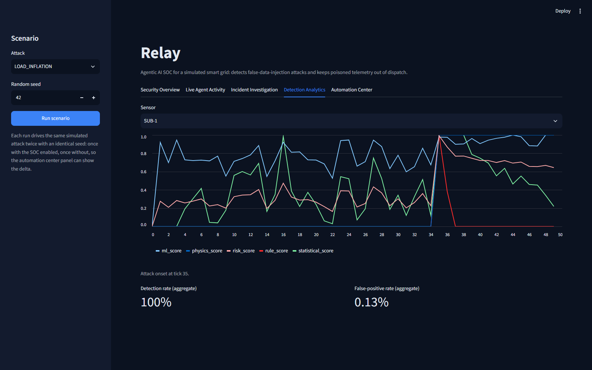
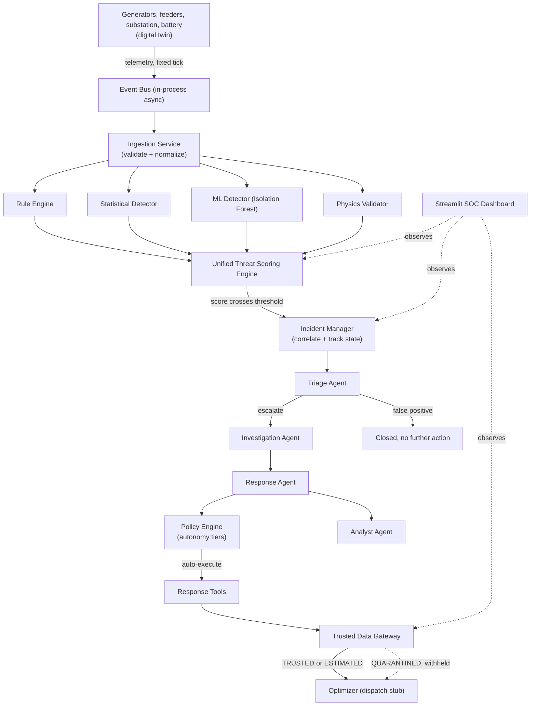
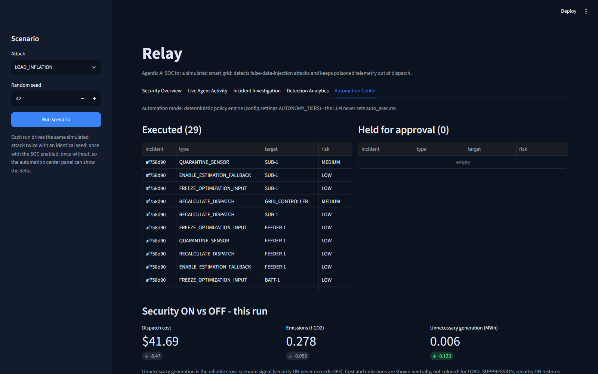

<h1 align="center">Relay</h1>

<p align="center">
  An AI-driven Security Operations Center that keeps false-data-injection attacks out of a smart grid's dispatch decisions.<br/>
  Verify the telemetry first. Optimize second.
</p>

<p align="center">
  <a href="#getting-started"><b>Get started</b></a> ·
  <a href="#architecture"><b>Architecture</b></a> ·
  <a href="#key-results"><b>Key results</b></a> ·
  <a href="#roadmap"><b>Roadmap</b></a>
</p>

<p align="center">
  
  
  
  
</p>

---

## Overview

<p align="center">
  
</p>

A smart grid optimizes generation and distribution from live sensor data. That data is also the attack surface: a false-data-injection (FDI) attack manipulates readings so the grid acts on a false picture of reality. Inflate a load reading and the optimizer over-generates, raising cost and emissions for no reason. Suppress it and the optimizer under-generates against real demand, cutting reserve margin and risking unsafe dispatch. An optimizer that trusts its inputs unconditionally is only as safe as the sensors feeding it, and those sensors can be attacked.

Relay treats optimization and security as one problem. It runs a simulated grid, injects three FDI attack patterns against it, and defends it with a four-detector ensemble and a bounded, policy-gated multi-agent SOC:

1. A digital twin of a substation and its feeders emits telemetry on a fixed tick.
2. Four independent detectors, rules, statistics, an Isolation Forest, and physics consistency checks, each score every reading; a unified risk engine combines the four into one classification.
3. Alerts that cross the risk threshold open an incident, correlating related alerts from the same time window into one case with a timeline.
4. Four AI agents, mapped to real SOC roles (Triage, Investigation, Response, Analyst), investigate the incident and propose containment actions from a fixed, auditable action set. No agent has direct control over the grid.
5. A deterministic policy engine, not the agents, decides which actions execute automatically versus which need operator approval.
6. A trusted data gateway labels every sensor TRUSTED, ESTIMATED, or QUARANTINED, and the optimizer is only ever allowed to read a TRUSTED or ESTIMATED value. A quarantined sensor's raw reading never reaches dispatch.

The optimizer is deliberately simple: a dispatch stub that reports cost and emissions for a given load. Its only job is to make the impact of poisoned versus verified data measurable, not to model real dispatch optimization.

## Features

- **Four-detector ensemble.** A rule engine (hard physical bounds), a statistical detector (rolling z-score, EWMA, rate-of-change), an Isolation Forest trained on normal telemetry, and a physics validator (power balance, feeder-to-substation aggregation, battery state-of-charge consistency). Coordinated stealth attacks that look plausible sensor-by-sensor still fail the physics cross-checks.
- **Unified Threat Scoring Engine.** Combines the four detector scores into one weighted risk score, classified into five bands (`NORMAL` through `CRITICAL`), with the full evidence breakdown attached to every reading.
- **Bounded multi-agent SOC.** Triage, Investigation, Response, and Analyst agents run in a fixed order via LiteLLM, each constrained to a JSON schema validated with Pydantic and backed by a deterministic fallback if the LLM call fails or returns invalid output. A false positive stops after Triage; only an escalation runs the full pipeline.
- **Deterministic policy engine.** `auto_execute` on every response action is set by `config.settings.AUTONOMY_TIERS`, keyed to the incident's classification, never by the LLM. One action type (`ISOLATE_SUBSTATION`) is always held for operator approval regardless of tier.
- **Trusted Data Gateway.** Every sensor stream carries a TRUSTED, ESTIMATED, or QUARANTINED label. The optimizer can only read a TRUSTED or ESTIMATED value; a quarantined sensor's raw reading is withheld until an estimation fallback is enabled.
- **Alert correlation.** Alerts within a configurable time window on related assets fold into a single incident with one timeline, instead of opening a new case per alert.
- **Evaluation harness.** Runs each attack scenario N times with randomized parameters under a fixed seed, security ON and OFF, and reports detection rate, false-positive rate, latency, and prevented cost/emissions/unnecessary-generation to `results/`.
- **Live SOC dashboard.** Five Streamlit tabs (Security Overview, Live Agent Activity, Incident Investigation, Detection Analytics, Automation Center) drive the same scenario twice, security enabled and disabled, and show the delta.

<p align="center">
  
</p>

## Architecture



<p align="center">
  
</p>

### Project structure

```
relay/
├── config/settings.py           # tunables: weights, thresholds, tolerances, tick rate
├── schemas/models.py            # every Pydantic data contract
├── simulator/                   # digital twin, telemetry, three attack scenarios
├── automation/event_bus.py      # asyncio publish/subscribe
├── ingestion/service.py         # validate, normalize, publish
├── detection/                   # rule engine, statistics, Isolation Forest, physics, unified risk engine
├── soc/
│   ├── incident_manager.py      # incidents, correlation, state machine
│   ├── policy_engine.py         # classification -> autonomy tier -> auto_execute
│   ├── orchestrator.py          # drives the four agents in order
│   ├── threat_kb.py             # known attack patterns
│   ├── agents/                  # triage, investigation, response, analyst
│   └── tools/response_tools.py  # fixed safe action set
├── gateway/trusted_data_gateway.py  # TRUSTED / ESTIMATED / QUARANTINED
├── optimization/                # dispatch stub, estimation fallback
├── evaluation/                  # harness, ON vs OFF comparison, results output
├── dashboard/                   # Streamlit SOC dashboard
├── tests/
└── results/                     # metrics.csv, metrics.json, metrics.md (generated)
```

## Tech stack

| Layer | Technology |
|-------|------------|
| Language | Python 3.11 |
| Data contracts | Pydantic v2, for every boundary in the system |
| Simulation | NumPy, pandas |
| ML detection | scikit-learn (Isolation Forest) |
| Agent reasoning | LiteLLM (default Groq `gpt-oss-120b`, Gemini Flash as a documented alternative) |
| Orchestration | Hand-written deterministic state machine, no agent framework |
| Event transport | asyncio publish/subscribe (in-process) |
| Storage | SQLite |
| Dashboard | Streamlit |
| Testing / linting | pytest, ruff |

Two deliberate substitutions, chosen to spend the available time on the security pipeline rather than infrastructure:

- The in-process event bus stands in for a real message broker (MQTT or similar). It keeps one publish/subscribe seam so a broker can replace it without touching the rest of the system.
- Streamlit stands in for a production web frontend. It renders the full dashboard spec in Python with no separate frontend build.

## Getting started

Requires Python 3.11+.

```bash
git clone <this-repo>
cd relay
python -m venv .venv
.venv/Scripts/activate        # .venv/bin/activate on macOS/Linux
pip install -r requirements.txt
cp .env.example .env          # optional, see below
```

Relay runs fully without an LLM key: every agent falls back to a deterministic default (logged as a warning) if no key is set or the call fails. Set `GROQ_API_KEY` or `GEMINI_API_KEY` in `.env` and adjust `LLM_MODEL` to use a real model for agent reasoning.

**Run the console demo** (simulator through detection, incident response, and dispatch, with one manually injected out-of-range reading):

```bash
python main.py
```

**Run the SOC dashboard:**

```bash
streamlit run dashboard/app.py
```

Pick a scenario in the sidebar and click Run scenario. The dashboard simulates the same attack twice, once with the SOC enabled and once without, and shows the live incident, agent activity, detection scores, and the cost and emissions delta between the two runs.

**Run the evaluation harness** (produces `results/metrics.csv`, `results/metrics.json`, and `results/metrics.md`):

```bash
python -m evaluation.harness
```

Defaults to 30 runs per scenario. Every agent call attempts the configured LLM first, so a run without an API key spends time on failed network calls before falling back; expect the full run to take several minutes with no key configured, well under a minute with one.

**Run the tests:**

```bash
pytest tests/ -q
```

## Key results

Produced by `python -m evaluation.harness`: each of the three attack scenarios run 30 times with randomized parameters within realistic bounds, plus a normal baseline for the false-positive rate, under a fixed random seed.

### Detection results

| Metric | Value |
|---|---|
| Detection rate | 100.0% |
| False positive rate | 0.131% |
| Mean detection latency (ticks) | 0.46 |
| Mean containment latency (ticks) | 0.31 |

### Security ON vs OFF: impact prevented (summed across runs)

| Scenario | Cost prevented | Emissions prevented | Unnecessary generation prevented (MWh) |
|---|---|---|---|
| COORDINATED_FDI | -0.1971 | -0.0013 | -0.0121 |
| LOAD_INFLATION | 212.988 | 1.4194 | 3.4019 |
| LOAD_SUPPRESSION | -145.9402 | -0.9728 | 2.3031 |

**Security ON versus OFF** is the headline comparison: for every attack run, the pipeline executes twice, once with the SOC disabled (the optimizer consumes the poisoned reading directly) and once enabled (the attack is detected, the sensor quarantined, and a trusted estimate substituted).

Unnecessary generation avoided is the reliable signal for LOAD_INFLATION and LOAD_SUPPRESSION. Dollar cost prevented runs negative for LOAD_SUPPRESSION: security restores dispatch to the true, higher load, which costs more but corrects an unsafe under-generation. COORDINATED_FDI shifts feeder sensors, not the substation the optimizer dispatches from, so its reading stays correct in most runs and the ON/OFF dispatch is identical; the small negative numbers come from the minority of runs where cross-sensor physics evidence still implicates the substation and containment quarantines it as a precaution, trading its already-correct live reading for a slightly noisier estimate. The attack is still caught in every run (see the 100% detection rate above); the near-zero deltas are a limitation of the single-sensor optimizer stub, not a detection failure.

<p align="center">
  
</p>

## Design decisions

A few choices worth flagging:

**Why a trusted data gateway instead of just filtering alerts?**
An alert tells a human something is wrong. It does not, by itself, stop a poisoned reading from reaching the optimizer. The gateway is the enforcement point: every sensor carries a label, and the optimizer's read path checks that label before it ever sees a value. Detection without an enforcement seam is just a dashboard.

**Why does the policy engine decide `auto_execute`, never the LLM?**
Letting a model decide what it can also observe and score risks would blur the one line that matters here: what proposes an action versus what authorizes it. `soc/policy_engine.py` maps an incident's classification to a fixed set of auto-executable action types from `config.settings.AUTONOMY_TIERS`; the agents only ever propose from a closed action set, and one action type is always approval-only regardless of severity.

**Why four independent detectors instead of one model?**
Each detector catches a different failure mode. A rule engine catches gross out-of-range values instantly with zero training cost. Statistics catches drift and rate anomalies a fixed rule misses. The Isolation Forest catches multivariate patterns no single rule anticipated. Physics catches coordinated stealth attacks where every individual reading looks plausible but the aggregate does not balance, the case none of the other three can see. The unified risk engine only escalates on the combined score, not any single detector alone.

**Why Triage before the full pipeline runs?**
Running Investigation, Response, and Analyst on every alert is expensive and unnecessary for the incidents that are actually false positives. Triage is the cheap first gate: escalate or close. Only an escalation pays for the rest of the pipeline.

**Why an in-process event bus instead of a real broker?**
The live pipeline (`main.py`) needed exactly one publish/subscribe seam between ingestion and detection, not a production message queue. `automation/event_bus.py` keeps that seam explicit so a real broker (MQTT or similar) can be substituted later without touching the detection, SOC, or gateway code, none of which know or care where an event came from.

**Why Streamlit instead of a custom frontend?**
The dashboard's job is to make the pipeline's internal state legible, not to be a polished product surface. Streamlit renders five tabs of live state directly from Python objects with no separate frontend build, which kept the time budget on the detection and SOC logic instead of a UI layer.

## Roadmap

Near term:
- [ ] Autoencoder and LSTM temporal detection, ensemble scoring, and calibration
- [ ] A real MQTT broker in place of the in-process event bus
- [ ] A dedicated Trusted Data Gateway status view in the dashboard (today the gateway's TRUSTED/ESTIMATED/QUARANTINED state is only visible as a summary count and through the response actions that drive it)

Mid term:
- [ ] Additional attack types: replay, timestamp manipulation, command injection
- [ ] Weighted least squares state estimation in place of the simplified physics fallback
- [ ] A React or Next.js dashboard in place of Streamlit

Long term:
- [ ] Containerization
- [ ] Integration of a public smart-grid or FDIA dataset

## License

No license file is included yet. Treat this repository as all-rights-reserved until a `LICENSE` file is added.

---

<p align="center">
Built by <a href="https://github.com/TheMEGALODON55681">Aryan Sharma</a> · 2026
</p>
